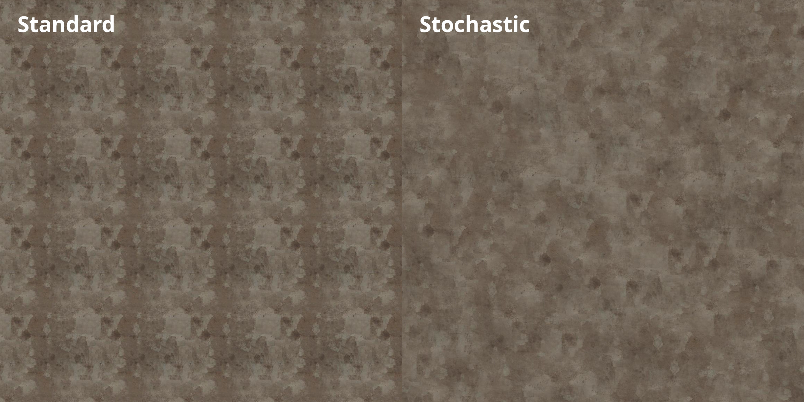

# Stochastic Texture Sampling

An implementation of [this paper](https://drive.google.com/file/d/1QecekuuyWgw68HU9tg6ENfrCTCVIjm6l/view?usp=sharing) for Godot (tested with 4.6)

all the logic is in `stochastic.gdshaderinc`
Do not use this shader on patterned textures (e.g., bricks)